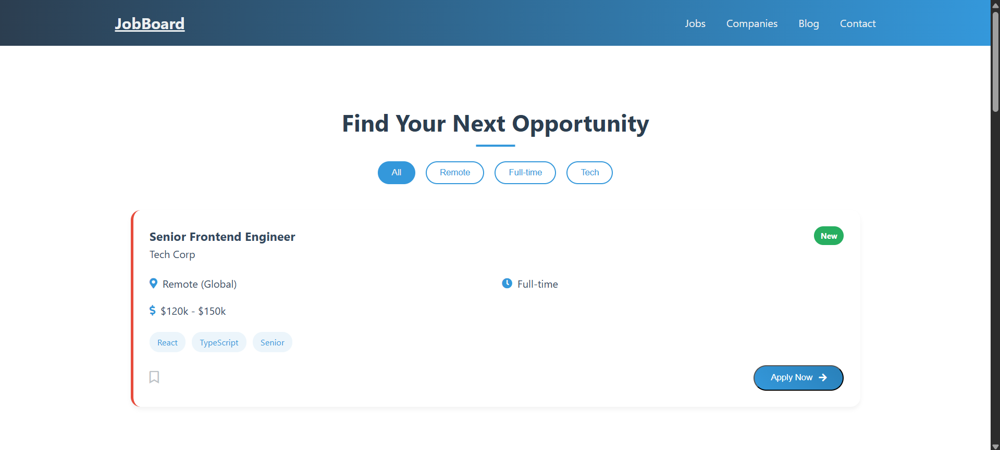

# JobBoard - Modern Job Board Application

 _Add screenshot of your project here_

A modern, responsive job board website featuring company listings, job postings, blog articles, and contact functionality. Built with pure HTML, CSS, and JavaScript.

## Features

- **Responsive Design**: Works seamlessly on all device sizes
- **Interactive Job Cards** with:
  - Company logos
  - Salary ranges
  - Job type indicators
  - Skill tags
  - Save/Bookmark functionality
- **Company Showcase** section with partner logos
- **Blog Section** with featured articles
- **Contact Form** with submission handling
- **Modern UI Components**:
  - Smooth animations
  - Gradient backgrounds
  - Card-based layout
  - Interactive filters
- **Sticky Navigation** with mobile menu

## Technologies Used

- HTML5 (Semantic markup)
- CSS3 (Flexbox, Grid, Variables)
- JavaScript (ES6+)
- Font Awesome Icons
